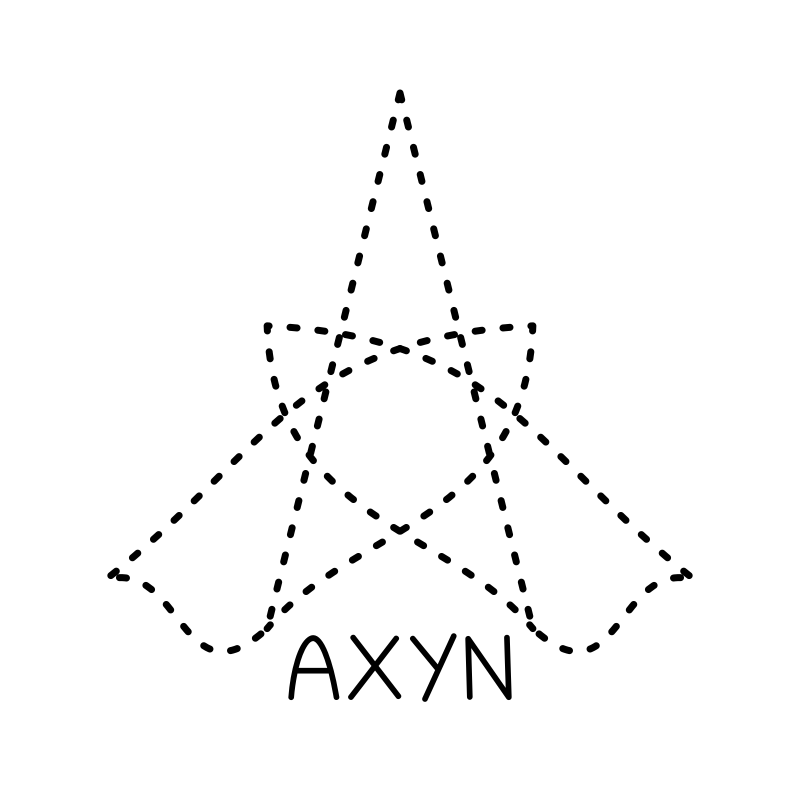

# Axyn

Discord interface to [Chatterbot](https://github.com/gunthercox/ChatterBot) with additional features.

**Support / testing server: https://discord.gg/4twAd8C**

## Summoning

You talk to Axyn by "summmoning" it to a channel of your choice using the command `a!summon`. This could be a text channel in a server, or a DM. Once summoned,  Axyn will try to respond to all messages sent within the channel until it is told to stop listening with `a!unsummon`, or automatically times out after a period of inactivity.

### Debug Mode

You may summon Axyn in debug mode by passing a debug flag to the command as `a!summon --debug`. This will attach some extra information as an embed to each message as well as converting all reactions from the bot into full messages.

## Analysis

Axyn provides the command `a!analyse`, which allows to run a sentence analysis on a sentence or paragraph of text and send the results to Discord as an image. This is powered by DisplaCy. A reference of what the different dependency types mean is available [here](https://spacy.io/api/annotation#dependency-parsing-english).
