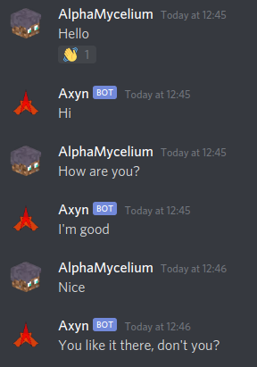

<p align="center">
  
</p>

# Axyn

A Discord chatbot using traditional algorithms.

## Run

Obtain a bot token from the
[Discord developer portal](https://discord.com/developers/applications).
Currently, the server members intent is required.

```sh
python -m pip install -e .
DISCORD_TOKEN=… axyn
```

## Usage

### Required Permissions

- Send messages
- Send messages in threads
- Embed links
- Manage slash commands

### Chat

Axyn will reply immediately if you:

- Send it a direct message
- Mention it
- Reply to a message it sent
- Talk in a channel with `axyn` in its name

Otherwise, it will wait some time before replying. The delay is adjusted using
the average interval between messages in the current channel.



If the bot stops typing and nothing is sent, it was unsure how to respond.
More uncertain messages are allowed through when replying immediately.

Axyn will learn a message if it fits all of these criteria:

- It contains some text
- It does not look like a bot command
- It was sent by a human user
- The author has enabled learning
- It is a reply, or Axyn can find a message which:
  - Contains some text
  - Is directly above this message
  - Was sent by Axyn or a human user (not other bots)
  - Was sent by a different author to this message
  - Was sent no more than 5 minutes before this message

## How does it work?

Axyn only uses traditional algorithms: in other words, it does not use a
[large language model](https://en.wikipedia.org/wiki/Large_language_model)
to generate output.

Instead, it watches real conversations and stores the messages, then when
prompted, it uses the sort of code you might find in a search engine to pick
out an appropriate reply from its database.

This means that anything Axyn says is a direct quote from a conversation it's
seen before.

## Privacy

Users must give permission for their messages to be stored. The first time a
user pings, replies to, or directly messages Axyn, they will receive a menu
allowing their preference to be changed. This menu can be accessed later using
the `/consent` command.

For a message to be reused, everyone in the current channel must have access to
the channel where the message was originally sent.
